# Guia definitivo para instalar o FEDORA no seu computador

1- Primeiro ja com a imagem ISO do fedora ja instalada, abra o ***Virtual Box***.

2- Aperte em novo para ***adicionar uma nova vitual box***

3- Depois disso vai entrar em uma janelinha para ***configurar sua maquina*** virtual.

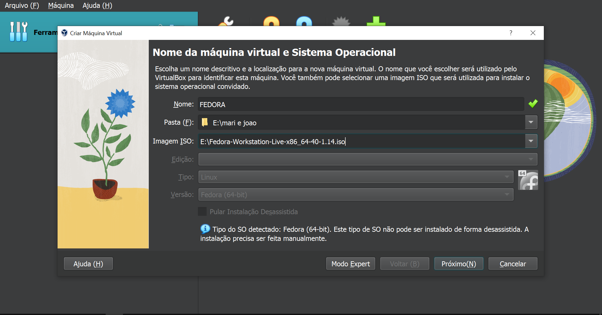

4- Nessa janela você vai configurar ***nome***,***caminho da pasta*** e o mais importante o arquivo de ***imagem ISO*** e clicar em proximo para entrar em nova janela de configuração.

5- Nessa nova janela você vai configurar agora a sua ***memoria base*** e o numero de ***processadoras*** na memoria base você pode colocar pelo menos ***4500 mb*** de memoria e ***2 processadores***. E aperta o botão proximo.

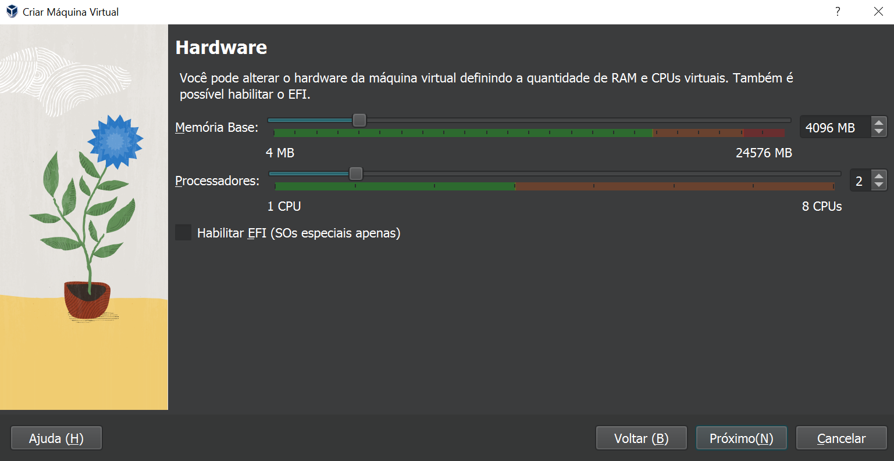
 
6- Agora você vai configurar o ***disco rigido*** aonde você ira colocar pelo menos ***55 gb***. E clicar em proximo.

7- Feito isso ira abrir o sumario onde você ira conseguir ver todas as coisas que você configurou dentro da sua maquina. E clica em ***finalizar***.

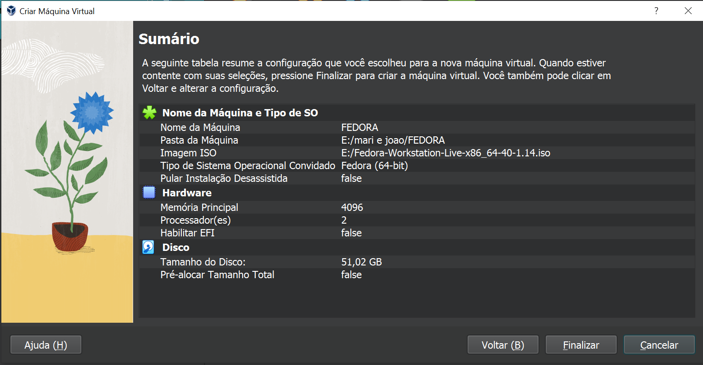

8- agora você ira finalmente ligar sua maquina e pra fazer isso é so clicar em ***iniciar***.

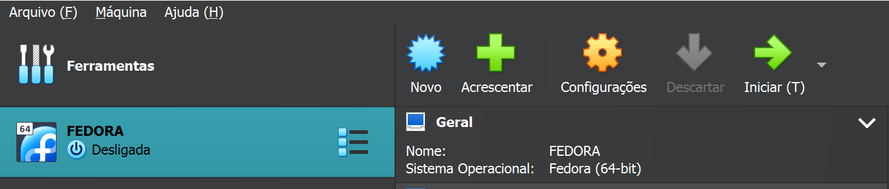

9- ligando a maquina ira aparecer 3 opções pra iniciar sua maquina mas, você ira colocar a primeiro ***opção clicando com o enter***. Agora é so aguardar.

.PNG>)

10- Se você chegou aqui é por que deu tudo certo e sua tela esta aberto na tela inicial do fedora onde você ira clicar em ***"install fedora"***
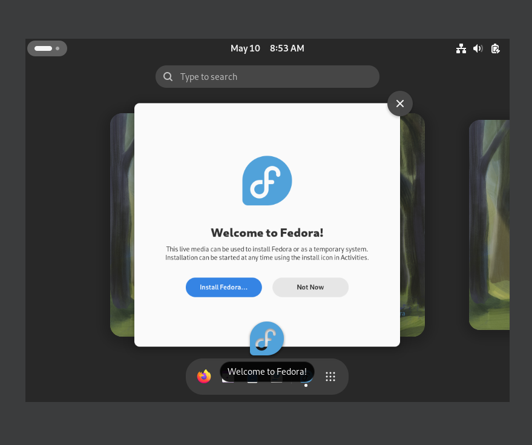

11- agora ira abrir a configuração do ***idioma***, onde você ira colocar o idioma que você quer e depois apertar em continuar.
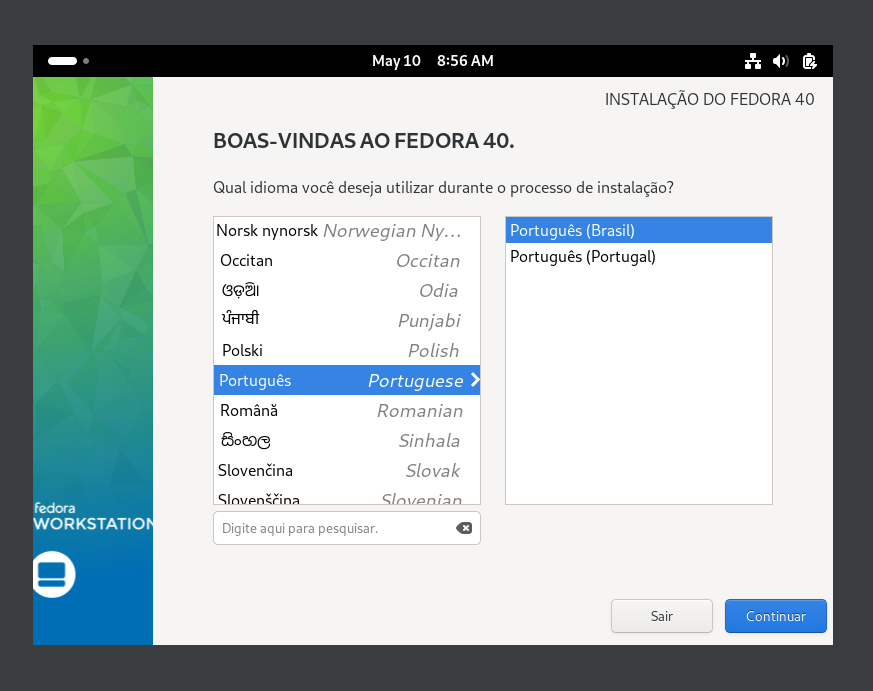

12- Agora ira abrir uma tela chamada resumo da instalação onde você ira clicar em ***destino de instalação*** e na parte de configuração de armazenamento você ira colocar a opção ***automatico*** e na opção disco padrão clicar no dico chamado ***"ATA VBOX HARDDISK"*** e depois clicar em pronto.
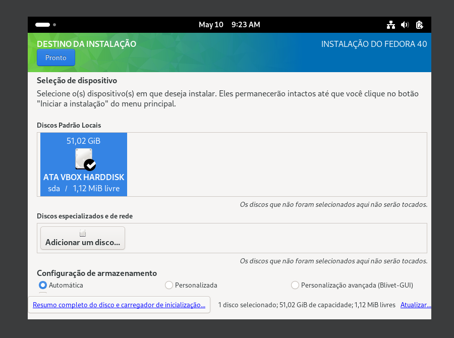

13- Agora ira abrir novamente a tela resumo de intalação onde você ira clicar na opção ***"iniciar a instalação"*** e ira abrir a tela ***progresso de instalação*** e ira aguardar por um momento a ***instalação***.

14- Depois te terminado o processo de instalação você clica o botão ***"Finalizar instalação"***.
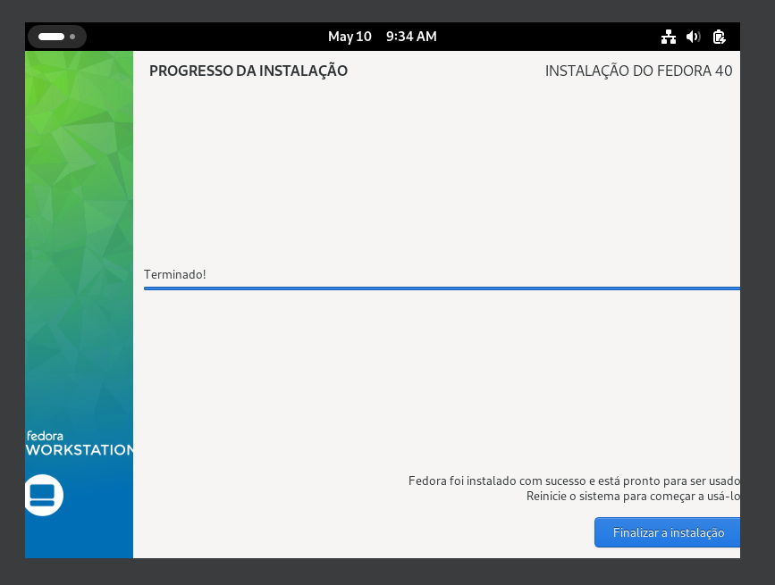

15- Agora você ira ***desligar*** sua maquina virtual e para fazer isso você clica em arquivo depois clica em fechar e por ultimo clique em ***"OK"*** e sua maquina sera ***desligada***.
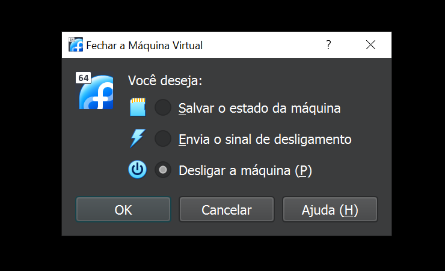

16- Feito isso ira abrir o virtual novamento e você ira clicar em configurações do fedora e depois clique em armazenamento e depois clique com o botão direito do mouse na opção  "fedora-workstation..." e clique remover depois ira aparecer se você quer mesmo mesmo remover e você confirma que sim, feito isso você ira fechar essa tela de configuração e iniciar novamente sua maquina virtual. 

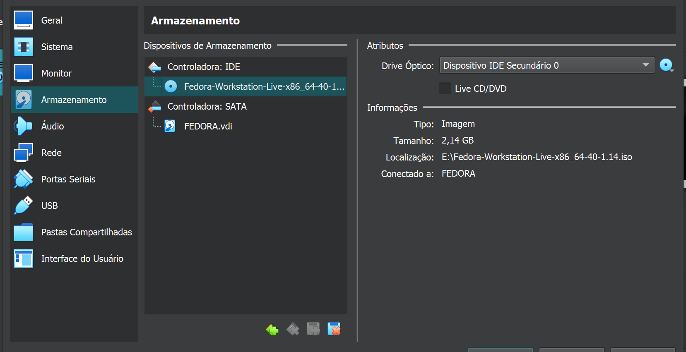

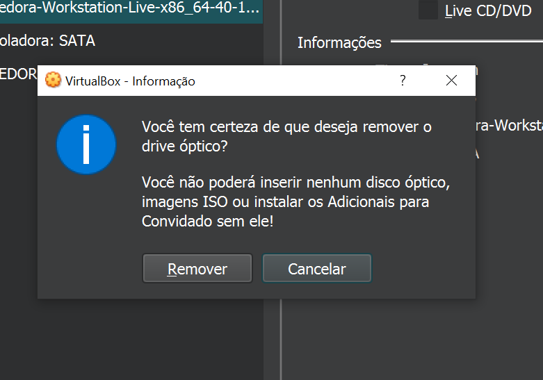

17- feito isso vai entrar em uma tela chamada definições onde você vai poder configurar as definições da sua maquina virtual. Então você apertara em "iniciar as definições" 
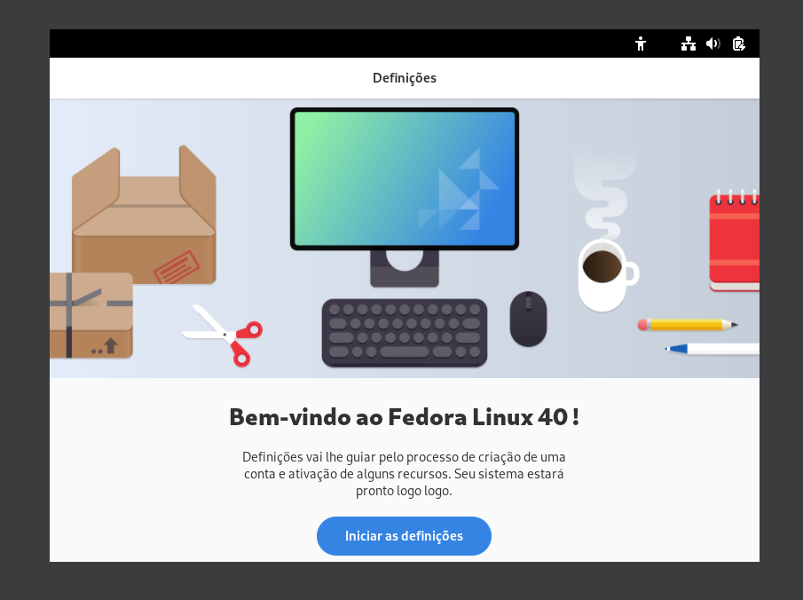

18- então ira abrir a tela de privacidade e você ira colocar de acordo com a sua preferência.E apertar em proximo.

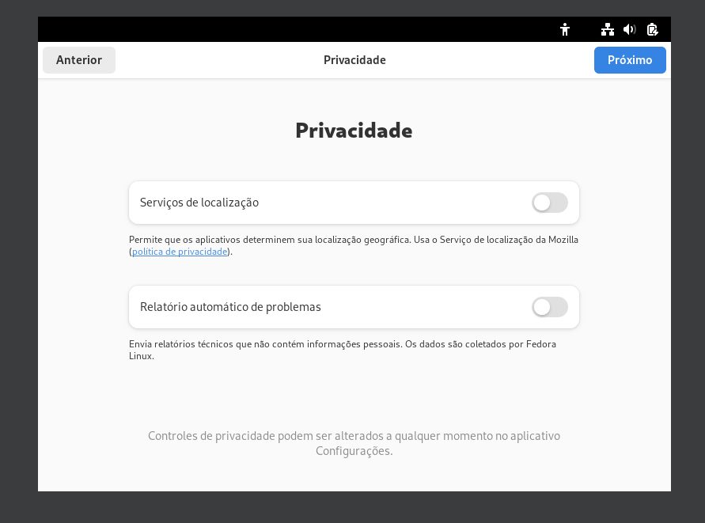

19- feito isso aparecera uma nova aba chamada repositorio de terceiros, habilitando a função.E aperte o proximo.

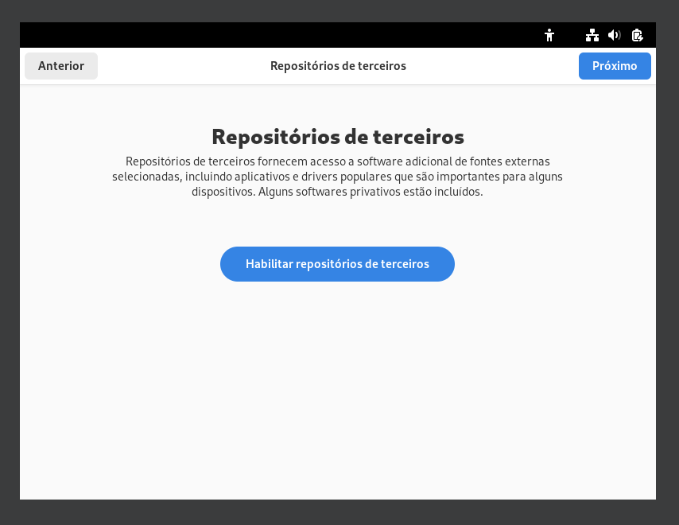

20- Agora você vai estar na tela chamada "sobre você", onde você ira preencher as informações necessarias.

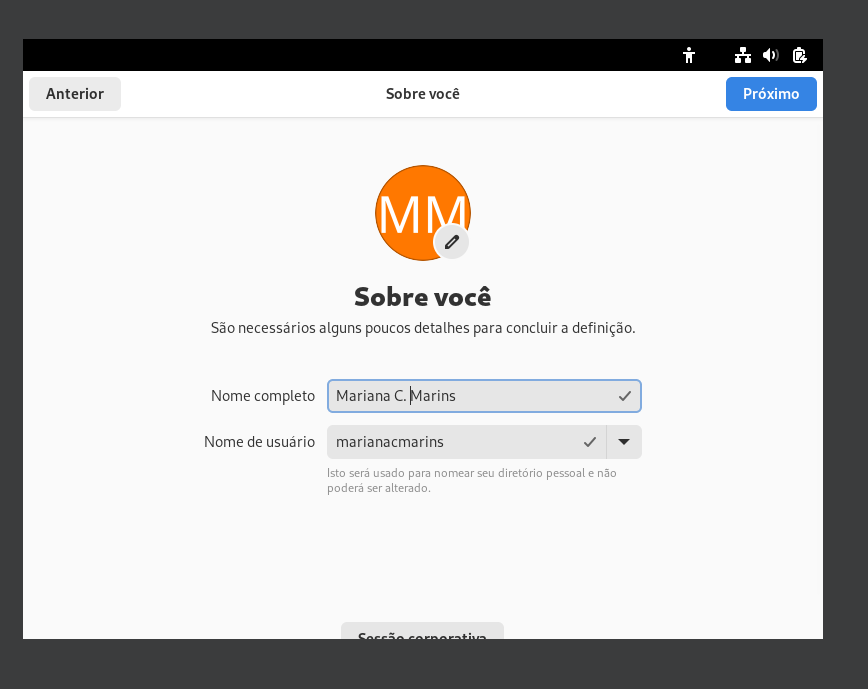

21- feito isso ira entrar em uma tela chamada senha onde você ira novamente preencher novamente com as informações necessarias.

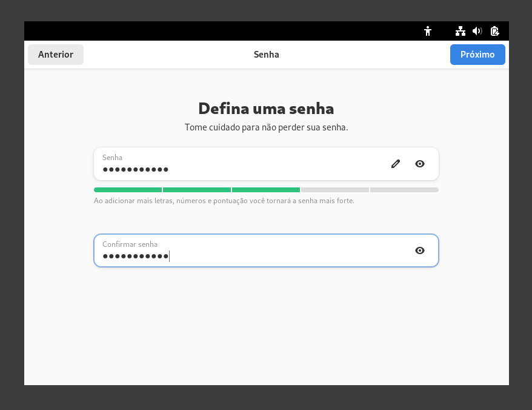

feito isso é so apertar pra iniciar seu FEDORA e pronto agora você podo utilizar sua maquina virtual.

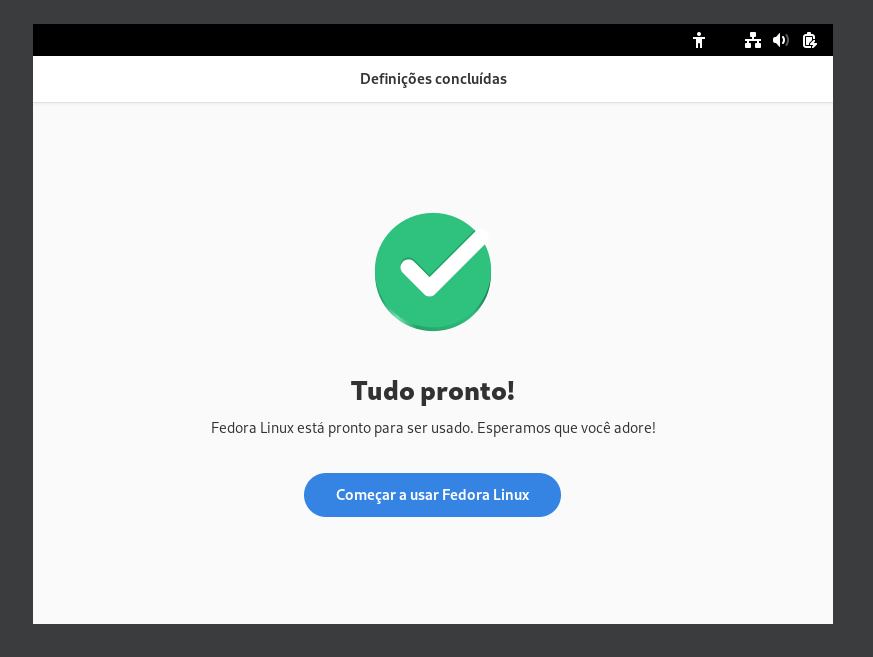

## by joão vitor e mariane martins

